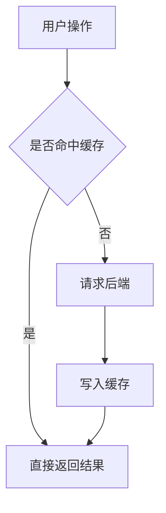

# Obsidian 笔记格式规范

## Vault 路径

```plain
$HOME/Documents/Obsidian Vault/
```

写入前先按当前用户展开 `$HOME`，确认目标目录存在，必要时用 `ls` 检查已有文档以了解当前目录结构。

## 格式规范

写 Obsidian 文档时，严格遵循以下排版约定。这些规则来自用户已有笔记的统一风格，保持一致性是第一优先级。

### 1. 空行规则：紧凑排版

标题、正文、代码块、引用块之间**不加多余空行**。标题后直接跟正文，正文后直接跟代码块或引用块。

**正确：**
```markdown
### 这是标题
这是正文内容，紧跟标题。
> 这是引用块，紧跟正文。
### 下一个标题
下一段正文。
```

**错误：**
```markdown
### 这是标题

这是正文内容，标题后多了一个空行。

> 这是引用块，前后多了空行。

### 下一个标题
```

例外：

- `---` 分隔线前后各保留一个空行，因为 Obsidian 需要这样才能正确渲染水平线。
- Markdown 表格前必须保留一个空行，尤其是紧跟“顶层字段：”这类引导句时；否则 Obsidian/GFM 可能把表格当成普通文本，无法正常渲染。表格后如果继续正文或标题，也保留一个空行以结束表格块。

表格示例：
```markdown
顶层字段：

| 字段 | 说明 |
| --- | --- |
| name | 技能名 |
```

不要写成：
```markdown
顶层字段：
| 字段 | 说明 |
| --- | --- |
| name | 技能名 |
```

### 2. 标题层级

- 用 `##` 做大章节标题
- 用 `###` 做子标题，常用问答式风格（如“XXX 是什么？”、“为什么要这样做？”）
- 用 `####` 做更细粒度的问答或补充

不要用 `#` 一级标题，Obsidian 的文件名已经充当了一级标题的角色。

### 3. 强调和补充

- **关键词和重要概念**用加粗
- 补充说明、注意事项用 `>` 引用块
- 警告或易错点在引用块开头加 ⚠️

```markdown
**Parcel** 是高效的二进制序列化容器。
> ⚠️ 这 1MB 不是单个事务独占的，而是**整个进程共享**的。
```

### 4. 文末结构

每篇文档末尾用 `---` 分隔线 + `## 相关笔记` 收尾，用 `[[]]` 双向链接关联笔记：
```markdown

---
## 相关笔记
- [[相关文档A]]
- [[相关文档B]]
```

### 5. 示意图表达策略

当内容包含流程、链路、状态变化、模块关系或抽象概念时，写图之前先判断用哪种介质最能让读者看清问题。最终目的只有一个：让读者以更清晰的视角理解答案、链路或分析结论。

- **Mermaid 优先用于结构化关系**：流程图、时序图、状态机、依赖关系、ER 关系、简单架构链路等，尽量用 Mermaid，不要用 ASCII 画复杂结构。
- **ASCII / `plain` 只用于很短的线性示意**：3 到 5 步以内、没有分支、没有并行关系、主要服务于正文节奏时可以使用。
- **SVG / 矢量图用于 Mermaid 表达不自然的结构**：需要自定义布局、空间关系、视觉分组、图标化表达或局部强调时，可以考虑生成 SVG 或其他可嵌入图片资产。
- **图像生成用于概念图或视觉解释**：当真实感、场景化、类比图、封面图或抽象视觉能明显提升理解时，可以考虑使用图像生成能力（如 ChatGPT / image 2），再把图片保存到合适目录并在笔记中引用。

选择规则：

1. 如果图的核心是**关系和方向**，优先 Mermaid。
2. 如果图的核心是**空间布局或视觉层次**，优先 SVG / 矢量图。
3. 如果图的核心是**形象化理解或视觉记忆点**，优先图像生成。
4. 如果图不能显著降低理解成本，就不要为了有图而画图。
5. 图里尽量少放长句，关键解释放在图下正文中。

Mermaid 示例：


### 6. 代码块

代码块指定语言标记（`kotlin`、`java`、`xml`、`plain` 等）。纯流程图或示意图用 `plain`：
```plain
onPause()
↓
onStop()
↓
onSaveInstanceState()
```

如果该示意图存在分支、循环、并行或跨模块关系，优先改用 Mermaid。

## 写作前检查清单

写入文档前，快速对照：

1. 标题后是否紧跟正文？（无多余空行）
2. 代码块/引用块前后是否紧凑？（无多余空行）
3. Markdown 表格前是否保留必要空行？
4. 文末是否有 `---` + `## 相关笔记`？
5. 是否有合适的 `[[]]` 双向链接？
6. 需要图示时，是否已选择最清晰的表达介质（Mermaid / ASCII / SVG / 图像生成）？

## 参考

写入前建议先读一篇同目录下已有的文档，确保风格完全对齐。
