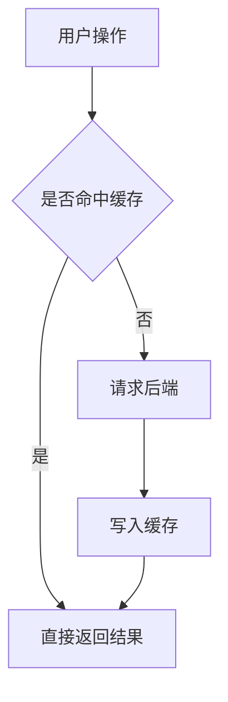

# Obsidian 笔记写作规范

## Vault 路径

```plain
$HOME/Documents/Obsidian Vault/
```

写入前先按当前用户展开 `$HOME`，确认目标目录存在，必要时用 `ls` 检查已有文档以了解当前目录结构。

## 写作工作流

写 Obsidian 笔记时，先把写作当成一个交付任务，而不是直接把用户的一句话扩写成文章。小笔记可以压缩执行这些步骤，但不能跳过任务边界、证据、结构和质检。

### 1. intake：任务定义

先明确这篇笔记的任务合同：

- 用户真正要保存的是**结论、方法、排查过程、知识框架、会议记录**还是**待办计划**。
- 这篇笔记给用户自己长期回看，不默认写给陌生读者；只补对未来回看有用的上下文。
- 如果涉及代码、产品、规范、工具版本、时间敏感资料或外部事实，先确认是否需要查本地仓库、已有笔记或联网资料。
- 如果标题、目录、路径、覆盖范围不明确，但可以从上下文合理推断，就先按最小可靠范围执行；会影响内容方向时再问用户。

### 2. scope：范围计划

动笔前定规模和边界：

- **小笔记**：只解释一个概念、一次排查、一个经验点或一段代码机制，用 2 到 5 个小节说清楚，不硬凑背景、原理、总结、FAQ。
- **中等笔记**：涉及多个角色、流程、取舍或踩坑，用“是什么 / 为什么 / 怎么做 / 注意什么”的自然顺序展开。
- **长笔记**：只有主题本身框架很大、需要建立完整认知地图时，才使用较多章节、阅读索引、示意图和参考链接。

范围计划要同时写清楚**不写什么**。如果主题很大，只写当前问题需要的部分，避免把笔记写成百科词条。

### 3. search：证据与素材

先拿证据，再写判断。根据任务选择素材来源：

- 技术实现：优先读代码、提交记录、配置、日志、接口文档和已有笔记。
- 概念或规范：优先查权威文档、项目 README、官方说明、标准或可信资料。
- 时间敏感内容：必须确认日期、版本和来源，不凭记忆写“最新”“当前”“现在”。
- 用户给出的截图、草图、链接、命令输出或口述结论，要先提炼为 evidence pack：关键事实、可引用片段、待确认点和不能推断的内容。

笔记正文不需要机械列出所有搜索过程，但关键结论必须能追溯到证据。证据不足时，用“待确认”“推测”“目前看到”标出边界，不要装作确定。

### 4. spec：内容规格

写正文前先形成一个 completed spec：

- 一句话说明这篇笔记要回答的问题。
- 列出 3 到 7 个必须成立的核心判断。
- 给每个核心判断绑定证据、例子或推理依据。
- 标出非目标、未知项和不确定项。
- 确定目标文件名、目录和可能关联的 `[[相关笔记]]`。

如果 completed spec 说不清，先补证据或缩小范围，不要直接进入长篇初稿。

### 5. outline：大纲

大纲必须服务理解，不服务形式完整。标题应该像读者脑子里的问题，而不是资料目录。优先使用：

- `什么是 X？`
- `为什么需要 X？`
- `X 和 Y 的关系`
- `什么时候值得做 X？`
- `设计 X 时要避免什么？`
- `核心结论`

每个二级标题都要承担一个明确解释任务。无法说清作用的章节直接删掉；两个标题回答同一个问题时合并。

### 6. draft：初稿

初稿按 spec 和 outline 写，不要边想边堆资料。正文要满足：

- 开头先给定位、结论或影响范围，让未来回看时能快速判断这篇笔记值不值得继续读。
- 段落承载判断和解释，列表收束并列点、步骤、条件和清单。不要把整篇笔记写成连续 bullet list。
- 先讲边界，再讲细节；先讲结论，再讲过程；先讲为什么重要，再讲怎么做。
- 代码、命令、字段、配置和链路要具体到可复查，避免只写抽象概念。

### 7. rewrite：人味化改写

初稿完成后必须改写一次，目标是去掉模板味和 AI 味：

- 删除“总之、值得注意的是、从某种意义上、核心在于”等空转句。
- 把泛泛判断改成具体对象、条件、例子或反例。
- 把过长列表改成段落解释；把并列混乱的段落改成表格或列表。
- 保留用户个人语境：这篇笔记为什么对当前工作流有用、未来什么时候会查它。
- 遇到强判断时检查证据是否足够；不够就降级措辞或标注待确认。

### 8. image-brief：配图计划

只有当图能明显降低理解成本时才配图。先写 image brief，再画图或生成图片：

- 图要解决什么理解问题。
- 图中的节点、方向、分组和强调对象是什么。
- 选择 Mermaid、ASCII、SVG / 矢量图还是图像生成。
- 图前用一句话说明为什么看图，图后用正文点出图里最重要的结论。

不要为了让笔记“看起来完整”而配图。同一小节不要连续堆多张表达相近的图。

### 9. review：交付质检

交付前先做大问题审查，再做排版审查：

- 任务是否回答了用户真实问题，而不是写成通用教程。
- 关键判断是否有证据、例子或推理支撑。
- 范围是否过大，是否混入和当前主题无关的背景。
- 标题顺序是否符合读者理解路径。
- 是否存在事实过期、版本不明、来源缺失或推断过度。
- 是否有一眼可见的模板句、口号式总结或重复段落。

修订不是只改错别字和语气；优先调整论点、证据、结构和详略，再处理措辞。

### 10. package：写入交付

写入 Obsidian 前确认：

- 文件路径、文件名和目录符合 Vault 现有结构。
- 图片或 SVG 等资产放在当前 Vault 的合适目录，优先使用 `img/`。
- 文末有 `---` + `## 相关笔记`，并尽量提供真实可用的双链。
- 如果使用外部资料，正文中保留必要来源链接或来源说明。
- 最终笔记不暴露“intake / scope / spec”这些流程痕迹，除非用户明确要写作过程记录。

## 常用笔记结构

根据任务类型选择结构，不要机械套同一个模板。

### 概念解释

适合解释一个机制、技术名词、工具能力或设计概念：

```markdown
## 核心结论
## 它解决什么问题？
## 它不是什么？
## 关键机制
## 使用边界
## 相关笔记
```

### 技术链路

适合代码链路、系统流程、状态流转和接口调用：

```markdown
## 核心结论
## 入口在哪里？
## 数据怎么流动？
## 哪些分支最容易误判？
## 排查或修改时看哪里？
## 相关笔记
```

### 问题复盘

适合 Bug、线上问题、排查记录和踩坑沉淀：

```markdown
## 现象和影响
## 结论
## 根因链路
## 验证过程
## 修复和预防
## 相关笔记
```

### 资料整理

适合把外部文章、规范、会议材料或调研资料整理成个人知识：

```markdown
## 先给结论
## 来源之间的差异
## 对当前工作的影响
## 可以复用的做法
## 待确认问题
## 相关笔记
```

## 写作风格

Obsidian 笔记主要给用户自己长期回看，不写成营销文、教程模板或面向陌生读者的百科词条。优先追求**密度高、边界清楚、解释到位**，而不是章节多、概念全或形式完整。

### 1. 先定位，再展开

每篇笔记开头优先给出核心定位或更新时间：

- 如果内容依赖外部资料、规范版本、工具版本或当前时间，在开头用 `>` 写明更新时间和依据。
- 如果是概念解释，第一节先说明“它是什么 / 不是什么 / 解决什么问题”。
- 如果是问题复盘，第一节先说明现象、结论和影响范围，再展开过程。

正文按“先讲清边界，再讲细节”的方式推进。避免一开始堆定义、名词或历史背景，让读者先知道这件事放在什么位置。

### 2. 用段落解释，用列表收束

段落用于承载判断和解释，列表用于收束并列点、步骤、条件和清单。不要把整篇笔记写成连续 bullet list。

一个好的段落通常只讲一个判断，长度控制在 1 到 3 句。需要比较角色、风险、方案或字段时，优先用表格；表格之后要用正文解释最关键的结论，不要让表格自己承担全部表达。

### 3. 避免烂笔记模式

以下模式一出现就要重写：

- 用通用背景开头，迟迟不回答当前问题。
- 只有“是什么、为什么、怎么做”的空壳，没有具体判断。
- 罗列很多概念，但没有解释它们之间的关系。
- 把资料摘要当笔记，没有写出对用户工作流的影响。
- 每段都像结论，但没有证据、例子或边界。
- 为了显得完整而加入历史、分类、FAQ、展望等无关章节。

## 格式规范

写 Obsidian 文档时，严格遵循以下排版约定。这些规则来自用户已有笔记的统一风格，保持一致性是第一优先级。

### 1. 空行规则：紧凑排版

标题、正文、代码块、引用块之间**不加多余空行**。标题后直接跟正文，正文后直接跟代码块或引用块。

**正确：**
```markdown
### 这是标题
这是正文内容，紧跟标题。
> 这是引用块，紧跟正文。
### 下一个标题
下一段正文。
```

**错误：**
```markdown
### 这是标题

这是正文内容，标题后多了一个空行。

> 这是引用块，前后多了空行。

### 下一个标题
```

例外：

- `---` 分隔线前后各保留一个空行，因为 Obsidian 需要这样才能正确渲染水平线。
- Markdown 表格前必须保留必要空行，尤其是紧跟“顶层字段：”这类引导句时；否则 Obsidian/GFM 可能把表格当成普通文本，无法正常渲染。表格后如果继续正文或标题，也保留一个空行以结束表格块。

表格示例：
```markdown
顶层字段：

| 字段 | 说明 |
| --- | --- |
| name | 技能名 |
```

不要写成：
```markdown
顶层字段：
| 字段 | 说明 |
| --- | --- |
| name | 技能名 |
```

### 2. 标题层级

- 用 `##` 做大章节标题。
- 用 `###` 做子标题，常用问答式风格（如“XXX 是什么？”、“为什么要这样做？”）。
- 用 `####` 做更细粒度的问答或补充。

不要用 `#` 一级标题，Obsidian 的文件名已经充当了一级标题的角色。

### 3. 强调和补充

- **关键词和重要概念**用加粗。
- 补充说明、注意事项用 `>` 引用块。
- 警告或易错点在引用块开头加 ⚠️。

```markdown
**Parcel** 是高效的二进制序列化容器。
> ⚠️ 这 1MB 不是单个事务独占的，而是**整个进程共享**的。
```

### 4. 文末结构

每篇文档末尾用 `---` 分隔线 + `## 相关笔记` 收尾，用 `[[]]` 双向链接关联笔记：

```markdown

---
## 相关笔记
- [[相关文档A]]
- [[相关文档B]]
```

### 5. 示意图表达策略

当内容包含流程、链路、状态变化、模块关系或抽象概念时，写图之前先判断用哪种介质最能让读者看清问题。最终目的只有一个：让读者以更清晰的视角理解答案、链路或分析结论。

配图是辅助理解，不是装饰，也不是越多越好。只有在图能明显降低理解成本时才画图：例如关系容易混、链路较长、层级抽象、文字解释会反复绕圈。图前正文要交代它解决什么理解问题，图后正文要点出图里最重要的结论。

- **Mermaid 优先用于结构化关系**：流程图、时序图、状态机、依赖关系、ER 关系、简单架构链路等，尽量用 Mermaid，不要用 ASCII 画复杂结构。
- **ASCII / `plain` 只用于很短的线性示意**：3 到 5 步以内、没有分支、没有并行关系、主要服务于正文节奏时可以使用。
- **SVG / 矢量图用于 Mermaid 表达不自然的结构**：需要自定义布局、空间关系、视觉分组、图标化表达或局部强调时，可以考虑生成 SVG 或其他可嵌入图片资产。
- **图像生成用于概念图或视觉解释**：当真实感、场景化、类比图、封面图或抽象视觉能明显提升理解时，可以考虑使用图像生成能力（如 ChatGPT / image 2），再把图片保存到合适目录并在笔记中引用。

选择规则：

1. 如果图的核心是**关系和方向**，优先 Mermaid。
2. 如果图的核心是**空间布局或视觉层次**，优先 SVG / 矢量图。
3. 如果图的核心是**形象化理解或视觉记忆点**，优先图像生成。
4. 如果图不能显著降低理解成本，就不要为了有图而画图。
5. 图里尽量少放长句，关键解释放在图下正文中。
6. 同一个小节不要连续堆多张表达相近的图；一张好图加一段解释通常比多张弱图更有效。
7. 引用本地图片时优先放在当前 Vault 的 `img/` 目录下，用 Obsidian 图片语法控制宽度，例如 `![[img/example.svg|691]]`。

Mermaid 示例：


### 6. 代码块

代码块指定语言标记（`kotlin`、`java`、`xml`、`plain` 等）。纯流程图或示意图用 `plain`：

```plain
onPause()
↓
onStop()
↓
onSaveInstanceState()
```

如果该示意图存在分支、循环、并行或跨模块关系，优先改用 Mermaid。

## 交付前检查清单

写入文档前，快速对照：

1. 是否完成任务定义、范围计划、证据收集、内容规格、大纲、初稿、改写、配图计划、质检和写入交付这 10 个心智步骤？
2. 这篇笔记是否回答了当前问题，而不是通用教程？
3. 关键结论是否有证据、例子或推理依据？
4. 标题后是否紧跟正文？（无多余空行）
5. 代码块/引用块前后是否紧凑？（无多余空行）
6. Markdown 表格前是否保留必要空行？
7. 文末是否有 `---` + `## 相关笔记`？
8. 是否有合适的 `[[]]` 双向链接？
9. 需要图示时，是否已选择最清晰的表达介质（Mermaid / ASCII / SVG / 图像生成）？
10. 当前篇幅是否匹配主题规模？小笔记有没有被硬凑成长文？
11. 每张图是否解决了明确的理解问题，并且图后有正文点明结论？

## 参考

写入前建议先读一篇同目录下已有的文档，确保风格完全对齐。技术长文风格可参考用户已有的 `Agent MCP 完全指南`：高信息密度、章节服务问题、配图服务理解、结尾用核心结论和相关笔记收束。
